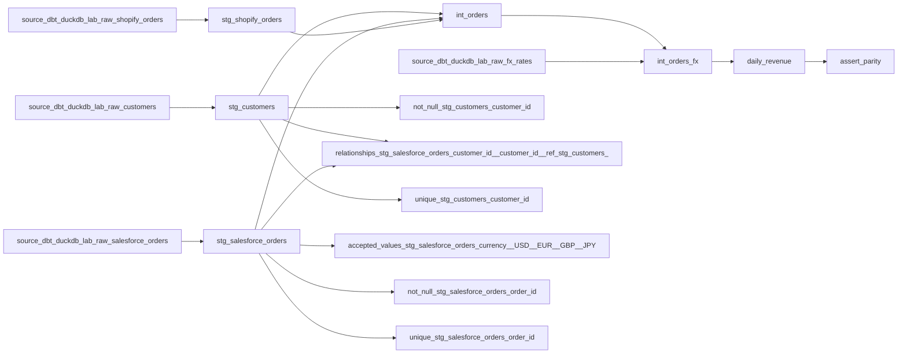

# DAG

```mermaid
graph LR
  daily_revenue --> assert_parity
  int_orders --> int_orders_fx
  int_orders_fx --> daily_revenue
  source_dbt_duckdb_lab_raw_customers --> stg_customers
  source_dbt_duckdb_lab_raw_fx_rates --> int_orders_fx
  source_dbt_duckdb_lab_raw_salesforce_orders --> stg_salesforce_orders
  source_dbt_duckdb_lab_raw_shopify_orders --> stg_shopify_orders
  stg_customers --> int_orders
  stg_customers --> not_null_stg_customers_customer_id
  stg_customers --> relationships_stg_salesforce_orders_customer_id__customer_id__ref_stg_customers_
  stg_customers --> unique_stg_customers_customer_id
  stg_salesforce_orders --> accepted_values_stg_salesforce_orders_currency__USD__EUR__GBP__JPY
  stg_salesforce_orders --> int_orders
  stg_salesforce_orders --> not_null_stg_salesforce_orders_order_id
  stg_salesforce_orders --> relationships_stg_salesforce_orders_customer_id__customer_id__ref_stg_customers_
  stg_salesforce_orders --> unique_stg_salesforce_orders_order_id
  stg_shopify_orders --> int_orders
```
