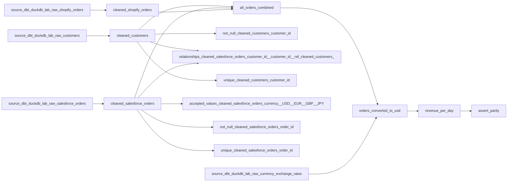

# DAG

```mermaid
graph LR
  all_orders_combined --> orders_converted_to_usd
  cleaned_customers --> all_orders_combined
  cleaned_customers --> not_null_cleaned_customers_customer_id
  cleaned_customers --> relationships_cleaned_salesforce_orders_customer_id__customer_id__ref_cleaned_customers_
  cleaned_customers --> unique_cleaned_customers_customer_id
  cleaned_salesforce_orders --> accepted_values_cleaned_salesforce_orders_currency__USD__EUR__GBP__JPY
  cleaned_salesforce_orders --> all_orders_combined
  cleaned_salesforce_orders --> not_null_cleaned_salesforce_orders_order_id
  cleaned_salesforce_orders --> relationships_cleaned_salesforce_orders_customer_id__customer_id__ref_cleaned_customers_
  cleaned_salesforce_orders --> unique_cleaned_salesforce_orders_order_id
  cleaned_shopify_orders --> all_orders_combined
  orders_converted_to_usd --> revenue_per_day
  revenue_per_day --> assert_parity
  source_dbt_duckdb_lab_raw_currency_exchange_rates --> orders_converted_to_usd
  source_dbt_duckdb_lab_raw_customers --> cleaned_customers
  source_dbt_duckdb_lab_raw_salesforce_orders --> cleaned_salesforce_orders
  source_dbt_duckdb_lab_raw_shopify_orders --> cleaned_shopify_orders
```
